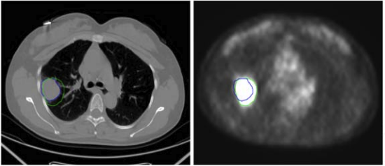
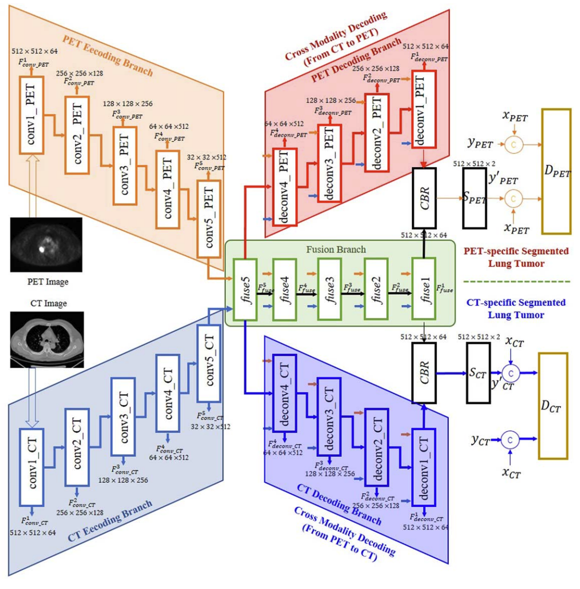
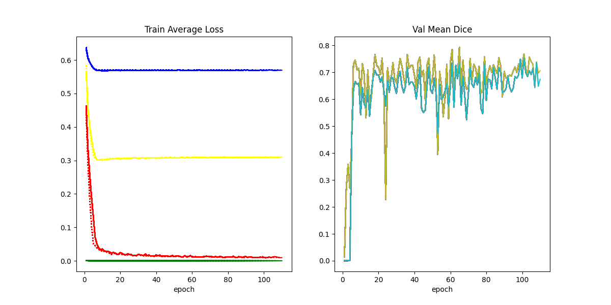

# PET-CT Lung Tumor Segmentation
  The official codes for ["Cross modality fusion for modality-specific lung tumor segmentation in PET-CT images"](https://pubmed.ncbi.nlm.nih.gov/36220014/).  
## Senario
  Due to respiration and movement, the lung tumor varies largely in PET images and CT images.  
    
  A multi-input and multi-output segmentation networks is proposed, which can imultaneously generates a PET-specific segmented result and a CT-specific segmented result, to overcome the inconsistency between the two modality-specific labels.  
    
## Config
  All hyperparameters are set in config.py, please modify it if necessary.  
  we provide several segentation models in model.py, including YNet, WNet, CrossAttentionXNet, CrossAttentionXNet, which are all for PET-CT Lung Tumor Segmentation. The difference between the models lies in the way the features are fused. You can specify the model in config.py.  
  we provide several loss functions in loss.py, including L1 Loss, CE Loss, Dice Loss and Edge Loss, you can just modify their weight coefficients in config.py.  
## Dataset
  The dataset used in this project won't be uploaded to protect the patients' privacy.  
  You can use your own dataset and modify the dataset path.  
## Qucik Start
  Train and test our model by "python main.py".
## Result
  The changing procedure of 4 loss functions and Dice Similarity Coefficient are shown in the curve figure.  
  
